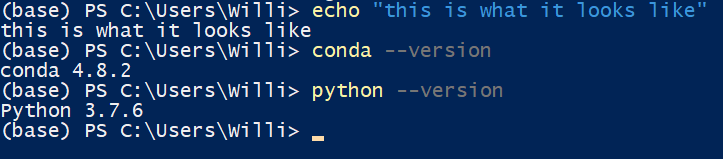

# Week Two Notes
This time a proper catalogue of things I've done!

## Anaconda 

Side note, this [markdown cheatsheet](https://github.com/adam-p/markdown-here/wiki/Markdown-Cheatsheet) is very useful to remember some basic markdown.

#### Now to be serious

No issues installing Anaconda, both conda --version and python --version provided me with the correct information confirming that I installed everything correctly. 

## Sublime Text

I already had Sublime Text installed since I use it occaisonally. I'm comfortable with how it works since I was introduced to it in my Grade 12 Computer Science Class and I have been using it ever since.

## Conda
Installing Conda went smoothly. I have used the command prompt before so I know some of its limitations/parlance etc. 

I faced issues trying to Install Rstudio through the Navigator so I downloaded it and R from the links provided.

## wget

Other people attempted to download and use it first, which showed some issues that were resolved quickly.
I at first tried to use just the wget command without wget.exe to see if I could replicate the issues others showcased on Discord, which I did. Then I used the proper notation but ran into more errors as seen in my [first](firstattempt.png) and [second](secondattempt.png) attempts at using wget.

I fiddled around with it for a good hour. I couldn't get wget to work so I found a work around. I copied wget.exe to each of the subfolders I needed it. This seemed to work so I left it at that and was going to ask for further help the next day at a more reasonable time. Then I googled the error I got 
> wget.exe : The term 'wget.exe' is not recognized as the name of a cmdlet, function, script file, or operable program. Check the spelling of the name, or if a path was included, verify that the path is correct and try again

and after reading some answers that didn't help, I went back to the course instructions and looked at my C:\ and realized that I had moved wget.exe to my C:\ drive and not to C:\Windows...
:facepalm:
So I moved it over properly and then deleted the contents of my folders and ran the required commands again to ensure everything worked, which it did.

While executing the commands, I learned about the recursive -r, no parent -np, links beyond our domain -l, and the wait time between requests -w, and the limit for bandiwth --limit-rate= flags for wget to properly and safely execute web requests. 

I faced no challenges attempting to download the Laura Gamble Diaries or War Diaries following the instructions.
I was able to use python to generate the required urls so that I could use wget to download. I then modified my wget command to utilize my urls.txt file to specify which images to download.

> wget -i urls.txt -r --no-parent -nd -w 2 --limit-rate=10

I really enjoyed working with the war diaries for reasons I'll discuss in [this week's journal](https://github.com/WilliamKohlman/week-two/blob/master/journal.md)

This work resulted in

 [urls.txt for the Laura Gamble Diary](LauraGamble-urls.txt)

[urls.py for the War Diaries](War-Diaries-urls.py), [urls.txt for the War Diaries](War-Diaries-urls.py)

## APIs
I had fun learning the basics of some APIs since for a lot of video games I play, I utilize  fan made sites/tools that rely heavily on API so this was interesting to learn the basics of it.

Refreshed my memory on importing modules, creating and defining variables.

This work resulted in:

[data.json](data.json), and then the converted to excel format [data.xlsx](data.xlsx)

[ca.py](ca.py)

I wanted to play around and tinker with the code for other APIs but unfortunately I did not have the time this week but this will act as a good base to go back to.

## OCR

Faced the same difficulty many other students discussed on discord, that Rstudio would not install through the Conda Navigator. So I followed Dr. Graham's suggested solution to download Rstudio and R separately from the links he provided. I was able to install Rstudio and R follwing the instructions contained in the links and had no issues once I figured out where Rstudio had actually installed.

Learned the basics of Rstudio, how to work in it, how to set the working directory, how to install packages, libraries, how to run stuff, etc. 

## Bonus

I really wanted to get into the bonus work this week becaus the topic really interested me, and transcribing videos (And downloading youtube videos...) is interesting and I wanted to play around in it. I may use some of my free time on Victoria Day to go back to it, or I may just take the whole day off and re-visit this later.

